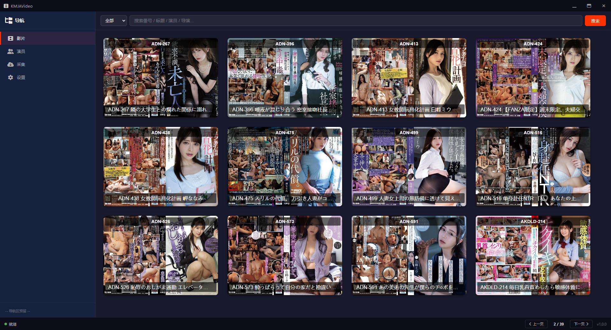

# KMJAVideo

基于 Electron + Vue 3 + Vite 的本地影片索引与管理桌面应用。

## 功能概览

- **影片扫描** — 扫描本地目录，自动识别番号并入库
- **影片浏览** — 封面墙展示，支持搜索、筛选（全部 / 无数据 / 无图）
- **演员管理** — 聚合演员列表，按影片数量排序
- **影片详情** — 独立窗口展示完整元数据
- **视频播放** — 支持内置播放器、系统默认播放器、自定义播放器
- **数据管理** — 数据库统计、清空影片列表（不动元数据）
- **数据持久化** — SQLite 本地存储，数据随身携带

> ℹ️ 影片元数据采集功能已迁移至独立项目 **JAVSpider**，请配合使用。

## 截图

**影片浏览**



**演员管理**


**影片详情**


## 技术栈

| 层级   | 技术                 |
| ------ | -------------------- |
| 框架   | Electron 30          |
| 前端   | Vue 3 + Vite 5       |
| 数据库 | SQLite (sql.js WASM) |
| 打包   | electron-builder     |

## 快速开始

```bash
# 安装依赖
npm install

# 开发模式运行
npm run dev

# 或双击 run.bat
```

### 构建发布包

```bash
npm run build
# 或双击 build.bat
```

打包产物输出到 `release/` 目录。

---

## 目录结构

```
KMJAVideo/
├── electron/             # Electron 主进程
│   ├── main.js           # 主进程入口、IPC 通信、数据库操作
│   └── preload.js        # 预加载脚本（桥接 API）
├── src/                  # Vue 前端
│   ├── components/       # Vue 组件
│   │   ├── LeftPanel.vue     # 左侧导航
│   │   ├── RightPanel.vue    # 影片列表
│   │   ├── ActorsPanel.vue   # 演员管理
│   │   ├── SettingsPanel.vue # 设置（导入、播放器、数据管理）
│   │   ├── DetailWindow.vue  # 详情子窗口
│   │   ├── TitleBar.vue      # 自定义标题栏
│   │   └── BottomBar.vue     # 底部状态栏
│   ├── App.vue           # 根组件
│   ├── main.js           # 前端入口
│   └── style.css         # 全局样式
├── public/               # 静态资源（字体、图标）
├── data/                 # 用户数据目录（详见下方说明）
├── index.html            # HTML 入口
├── vite.config.js        # Vite 配置
├── package.json          # 项目配置
├── run.bat               # 一键开发运行
└── build.bat             # 一键构建发布
```

---

## `data/` 目录说明

`data/` 是应用的**用户数据目录**，所有影片数据、图片、配置均存放在此。

```
data/
├── javdata.db            # SQLite 数据库（核心）
├── config.json           # 应用配置文件
├── thumb/                # 影片封面图
│   └── {番号}.jpg
└── actors/               # 演员头像
    └── {演员名}.jpg
```

### 数据库 (`javdata.db`)

SQLite 数据库，通过 sql.js 在内存中运行，写入时同步回磁盘。

**`movies` 表** — 影片索引

| 字段   | 说明           |
| ------ | -------------- |
| `num`  | 番号（唯一）   |
| `path` | 本地文件路径   |

**`movies_info` 表** — 影片元数据

| 字段           | 说明               |
| -------------- | ------------------ |
| `num`          | 番号（唯一）       |
| `title`        | 标题               |
| `originaltitle`| 原标题             |
| `studio`       | 片商               |
| `maker`        | 制作商             |
| `label`        | 系列/厂牌          |
| `year`         | 发行年份           |
| `premiered`    | 首映日期           |
| `release_date` | 发售日期           |
| `runtime`      | 时长（分钟）       |
| `director`     | 导演               |
| `plot`         | 剧情简介           |
| `actors`       | 演员（逗号分隔）   |
| `tags`         | 标签（逗号分隔）   |
| `thumb`        | 封面图路径         |
| `website`      | 来源链接           |
| `created_at`   | 创建时间           |

---

## 注意事项

- `data/` 目录包含个人数据，**不会被上传到 GitHub**（已加入 `.gitignore`），请自行备份
- 编译版的数据目录在 exe 同级的 `data/` 文件夹，方便移动和备份
- 清空影片列表仅删除 `movies` 表，`movies_info` 元数据不受影响

## License

MIT
